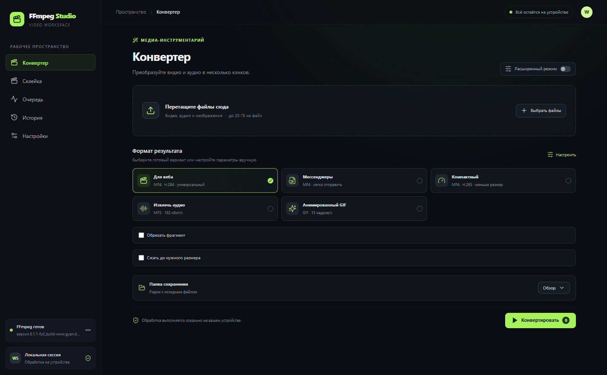

# FFmpeg Studio

**FFmpeg Studio** — настольная оболочка для локальной конвертации видео и аудио с помощью FFmpeg. Приложение не отправляет медиафайлы и не содержит телеметрию.



## Возможности

- Импорт перетаскиванием или через выбор файла; чтение метаданных ffprobe и превью видео.
- Профили MP4/H.264 для веба, компактный H.265, MP3 и GIF.
- Выбор контейнеров MP4, MKV, WebM, MOV и AVI; точная обрезка по началу и концу.
- Быстрая склейка совместимых видео без перекодирования, с перестановкой порядка клипов.
- Двухпроходное кодирование H.264 с заданным ограничением на размер файла.
- Прогресс, отмена, очередь задач и выбор папки результата.
- Настройки системного пути к FFmpeg.

## Требования и запуск

- Windows 11, Node.js 24+, npm и FFmpeg с ffprobe.
- Установите FFmpeg и добавьте его в PATH, затем выполните:

```sh
npm install
npm run dev
```

## Проверки и сборка

```sh
npm run lint
npm run typecheck
npm test
npm run test:e2e
npm run build
npm run dist
```

`npm run dist` собирает NSIS-установщик и portable версию Windows. Разработка macOS и Linux сборок пока не настроена.

## Английский

FFmpeg Studio is a local desktop interface for common FFmpeg conversion workflows. Media is processed on your device and telemetry is not included.

## Структура

- `electron/` — main/preload процессы и изолированный IPC.
- `src/shared/` — типы и детерминированный построитель аргументов.
- `src/renderer/` — React интерфейс.
- `docs/` — архитектурные решения и заметки.

См. [архитектуру](docs/ARCHITECTURE.md), [решения](docs/DECISIONS.md) и [заметки FFmpeg](docs/FFMPEG_NOTES.md).

## Ограничения первой версии

Пока нет визуального таймлайна, склейки несовместимых клипов с перекодированием, постоянной истории, автоустановки FFmpeg, извлечения кадров/субтитров и расширенных фильтров. Приложение сейчас имеет русский интерфейс; английский перевод ещё не добавлен. Дистрибутивы macOS/Linux не настроены.

## Лицензия

MIT. См. [LICENSE](LICENSE).
