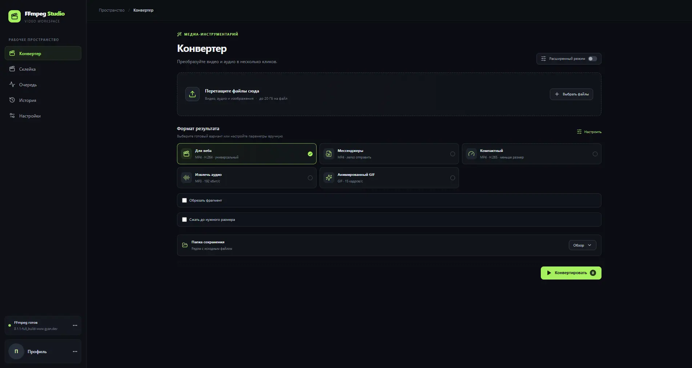
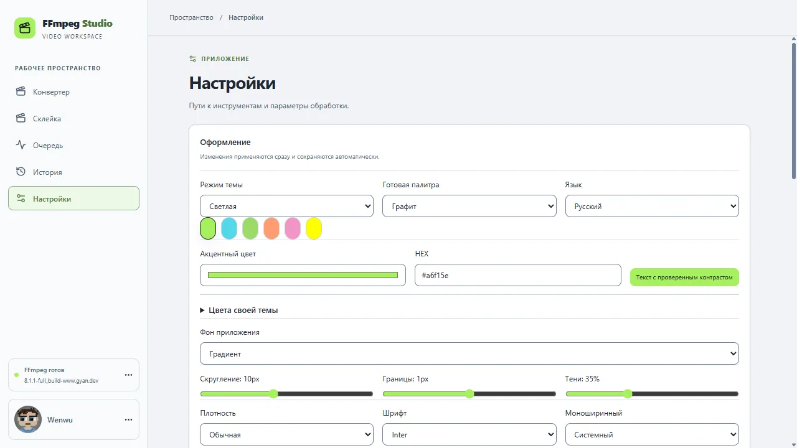
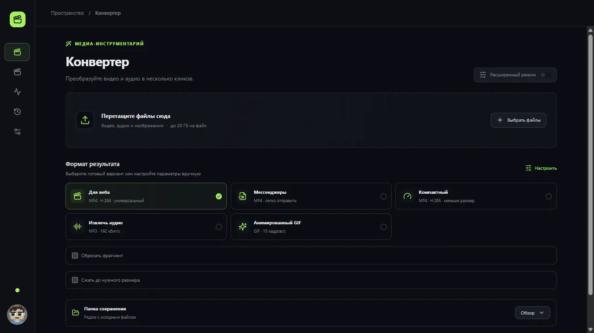

# FFmpeg Studio

**FFmpeg Studio** — настольное приложение для конвертации видео и аудио с помощью FFmpeg.



Светлая тема и свёрнутая боковая панель:




Другие экраны: [конвертер 1280×720](docs/screenshots/converter-1280x720.webp), [очередь 1920×1080](docs/screenshots/queue-1920x1080.webp), [оформление 1920×1080](docs/screenshots/appearance-1920x1080.webp), [настройки FFmpeg 1920×1080](docs/screenshots/ffmpeg-1920x1080.webp), [первый запуск](docs/screenshots/first-run-1280x720.webp). Все изображения находятся в [docs/screenshots](docs/screenshots/) и занимают меньше 300 КБ каждое.

## Возможности

- Импорт перетаскиванием или через выбор файла; чтение метаданных ffprobe и превью видео.
- Профили MP4/H.264 для веба, компактный H.265, MP3 и GIF.
- Выбор контейнеров MP4, MKV, WebM, MOV и AVI; точная обрезка по началу и концу.
- Быстрая склейка совместимых видео без перекодирования, с перестановкой порядка клипов.
- Двухпроходное кодирование H.264 с заданным ограничением на размер файла.
- Прогресс, отмена, очередь задач и выбор папки результата.
- Загрузка FFmpeg по явному запросу пользователя, проверка контрольной суммы, установка и переключение версий.
- Авторские иконки приложения и меню в системном трее с управлением очередью.
- Настраиваемые светлая, тёмная и системная темы, шесть палитр, RU/EN, акцент, фон, масштаб, плотность, шрифты и сохранённые профили оформления.
- Импорт/экспорт темы JSON, перестановка и скрытие разделов боковой панели, горячие клавиши, окно поверх других и сворачивание в трей.

## Как запустить

Единственный корень проекта — текущая папка репозитория; поддерживаемая платформа разработки — Windows 11 с Node.js 24+.
Из корня проекта выполните `npm install`, затем `npm run dev` для запуска среды разработки.
Для готовой Windows x64-сборки выполните `npm run dist` и запустите `release/optimized/FFmpeg Studio Setup <версия>.exe`.
Portable-версия создаётся рядом: `release/optimized/FFmpeg Studio <версия>.exe`.

```sh
npm install
npm run dev
```

## Проверки и сборка

```sh
npm run lint
npm run typecheck
npm test
npm run test:e2e
npm run build
npm run dist
```

Перегенерировать иконки после изменения `build/icon.svg` можно командой `npm run icons`. Она создаёт PNG-наборы, Windows ICO, macOS ICNS, favicon и монохромную иконку трея.

Загрузчик FFmpeg использует редактируемый список `resources/ffmpeg-sources.json`. В Windows доступны сборки Essentials/Full от Gyan.dev и зеркало BtbN; для macOS и Linux заданы статические источники. Архивы загружаются только после нажатия пользователем кнопки, проверяются по SHA-256, если источник публикует контрольную сумму, затем распаковываются в папку данных пользователя. Проверка обновлений выполняется вручную по кнопке. Подробности и лицензии: [docs/FFMPEG_NOTES.md](docs/FFMPEG_NOTES.md).

Параметры оформления валидируются схемой и хранятся в настройках пользователя; старый параметр темы мигрирует при запуске. Системный материал Mica/Acrylic доступен на совместимой Windows 11; при неподдерживаемой конфигурации окно использует стандартный материал.

`npm run dist` собирает NSIS-установщик и portable версию Windows x64. При первом запуске без FFmpeg приложение предлагает загрузить его; также можно указать бинарник или выбрать офлайн-архив. Разработка macOS и Linux сборок пока не настроена.

Размер новой Windows x64-сборки по сравнению с предыдущими артефактами 0.1.0:

| Артефакт | 0.1.0 | 0.2.2 | Изменение |
| --- | ---: | ---: | ---: |
| NSIS-установщик | 105 604 017 байт (100.71 МиБ) | 105 543 528 байт (100.65 МиБ) | −60 489 байт |
| Portable | 105 319 902 байт (100.44 МиБ) | 105 259 433 байт (100.38 МиБ) | −60 469 байт |
| Распакованное приложение | 356 380 989 байт (339.87 МиБ) | 356 378 584 байта (339.87 МиБ) | −2 405 байт |

В установщик не входят исполняемые файлы FFmpeg; приложение загружает их отдельно по запросу. Сборка включает только русскую и американскую английскую локали Chromium. RAM при простое и кодировании не замерялась.

## Английский

FFmpeg Studio is a desktop app for converting audio and video with FFmpeg. Switch between Russian and English in **Settings → Appearance → Language**.

## Структура

- `electron/` — main/preload процессы и изолированный IPC.
- `src/shared/` — типы и детерминированный построитель аргументов.
- `src/renderer/` — React интерфейс.
- `docs/` — архитектурные решения и заметки.

См. [архитектуру](docs/ARCHITECTURE.md), [решения](docs/DECISIONS.md) и [заметки FFmpeg](docs/FFMPEG_NOTES.md).

## Ограничения первой версии

Пока нет визуального таймлайна, склейки несовместимых клипов с перекодированием, извлечения кадров/субтитров и расширенных фильтров. Семейства Inter, Aptos и Arial выбираются из шрифтов, установленных в системе; сборка дистрибутивов macOS/Linux не настроена.

## Лицензия

MIT. См. [LICENSE](LICENSE).
