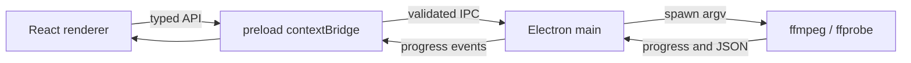

# Архитектура

Приложение разделено на безопасный renderer, узкий preload и main-процесс. В renderer отсутствует доступ к Node.js. IPC значения проверяются схемами Zod, процессы запускаются массивом аргументов без shell. Настройки сохраняются через `electron-store`.
